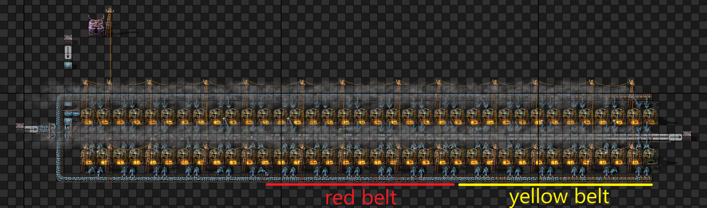

# Содержание
1. [Выбор билдов для тестирования](#Выбор-билдов-для-тестирования)
   1. [Стальные печи](#Стальные-печи)
   2. [Стандартный b8](#Стандартный-b8)
2. [Создание Шаблона для бенчмарка](#Создание-Шаблона-для-бенчмарка)
3. [Создания сохранения для билда Стальные печи](#Создания-сохранения-для-билда-Стальные-печи)
4. [Создания сохранения для билда Стандартный b8](#Создания-сохранения-для-билда-Стандартный-b8)

# Выбор билдов для тестирования
Для гайда выбрал два известных билда.

## Стальные печи

Стандартный билд со стальными печами. Все инсертеры - быстрые. Для удешевления строительства синие конвейера переходят в красные, затем в желтые.

## Стандартный b8

Стандартный билд b8. Для улучшения UPS используется clock.

# Создание Шаблона для бенчмарка

# Создания сохранения для билда **Стальные печи**

* Сохраним файл под именем "test_smelting_b0_x1"

# Создания сохранения для билда **Стандартный b8**
* Сохраним файл под именем "test_smelting_b8_x1"
# Клонирование

# Table of Contents
1. [Setup](#setup)
   1. [Memory Testing Software](#memory-testing-software)
      1. [Avoid](#avoid)
      2. [Recommended](#recommended)
      3. [Alternatives](#alternatives)
      4. [Comparison](#comparison)
   2. [Timings Software](#timings-software)
   3. [Benchmarks](#benchmarks)
2. [General RAM Info](#general-ram-info)
   1. [Frequency and Timings Relation](#frequency-and-timings-relation)
   2. [Primary, Secondary and Tertiary Timings](#primary-secondary-and-tertiary-timings)
3. [Expectations/Limitations](#expectationslimitations)
   1. [Motherboard](#motherboard)
   2. [ICs](#integrated-circuits-ics)
      1. [Thaiphoon Report](#thaiphoon-report)
      2. [Label on Sticks](#label-on-sticks)
      3. [A Note on Logical Ranks and Density](#a-note-on-logical-ranks-and-density)
      4. [Voltage Scaling](#voltage-scaling)
      5. [Expected Max Frequency](#expected-max-frequency)
      6. [Binning](#binning)
      7. [Maximum Recommended Daily Voltage](#maximum-recommended-daily-voltage)
      8. [Ranking](#ranking)
      9. [Temperatures and Its Effect on Stability](#temperatures-and-its-effect-on-stability)
   3. [Integrated Memory Controller (IMC)](#integrated-memory-controller-imc)
      1. [Intel - LGA1151](#intel---lga1151)
      2. [AMD - AM4](#amd---am4)
